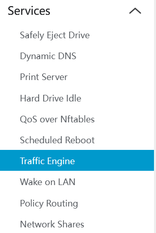
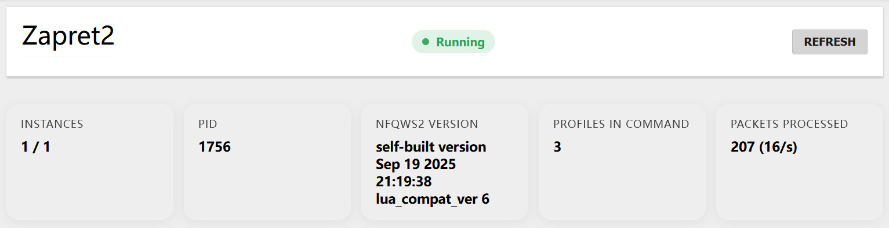
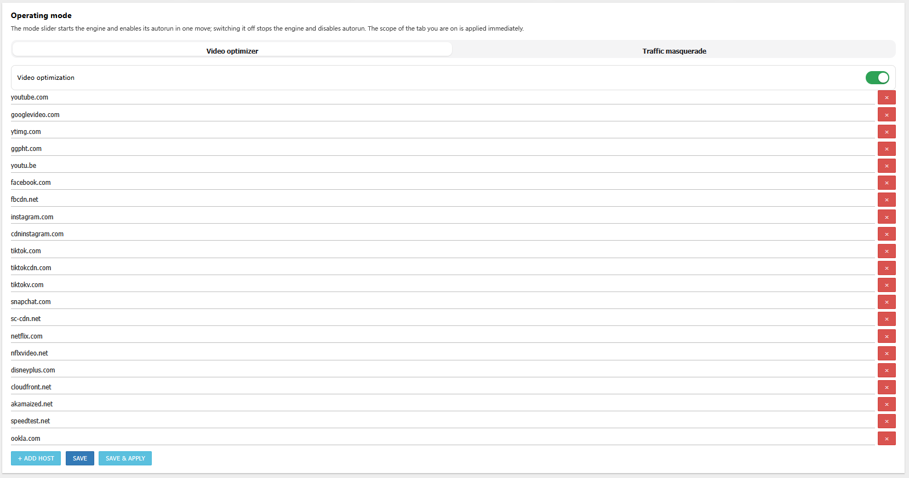
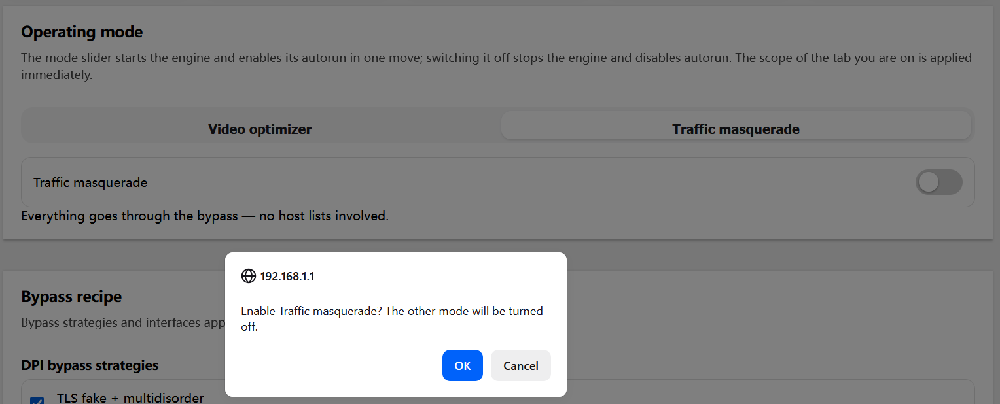
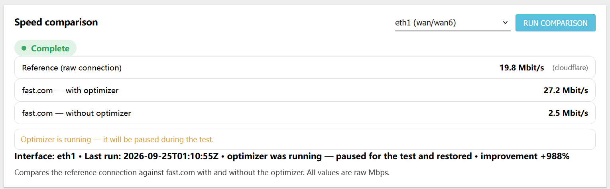
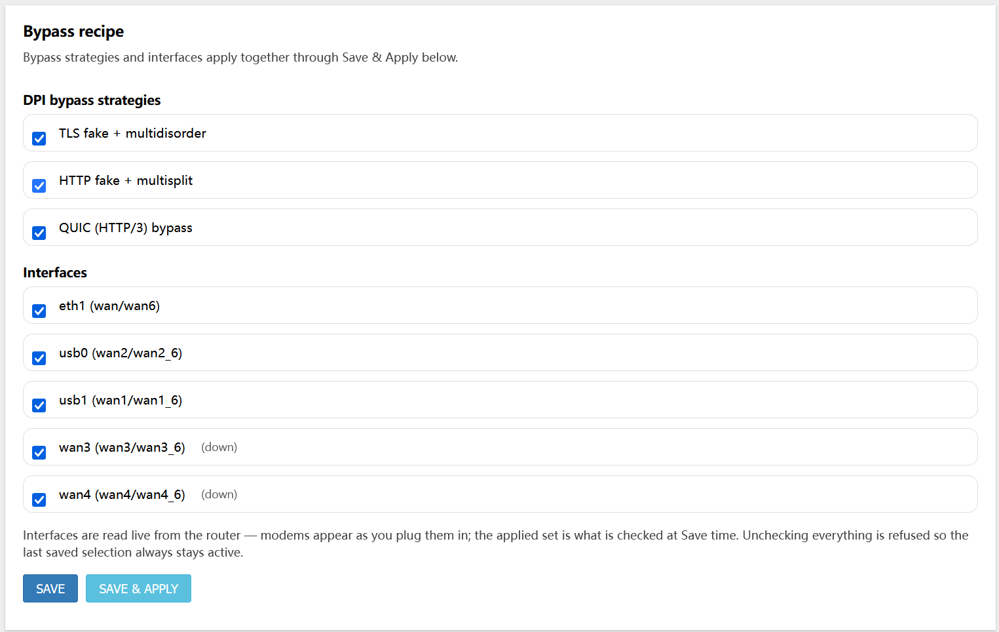

# luci-app-zapret2 + zapret2 (single feed repo)

Two OpenWrt packages, one repo. Use this repo directly as an
OpenWrt feed — no wrapper feed needed.

- **zapret2/** — thin packaging shim for upstream
  [bol-van/zapret2](https://github.com/bol-van/zapret2). Zero engine
  code: downloads the upstream release tarball, builds `nfqws2`
  from source, installs the stock runtime to `/opt/zapret2`.
  Installs disabled (first boot comes up Off).
- **luci-app-zapret2/** — LuCI panel ("Services → Traffic Engine")
  plus all UX: speed comparison, UCI-owned config, default host
  list, `zapret2-speedtest` backend, nft counter tagging.
  Depends on `zapret2` (pulls the engine automatically).

## Screenshots

Services → "Traffic Engine" panel:

- 
- 
- 
- 
- 
- 

## Building it into your firmware

Add this repo as an OpenWrt feed and select the packages:

```
echo "src-git zapret2 https://github.com/carp4/luci-app-zapret2.git" >> feeds.conf.default
./scripts/feeds update zapret2
./scripts/feeds install -a -p zapret2
```

Then in `make menuconfig`:

- `Network → Zapret → zapret2` — the engine
- `LuCI → Services → Traffic Engine` — the panel (pulls in `zapret2`)

Build your image as usual. The package format follows your OpenWrt
version: 24.x produces `.ipk` (`zapret2_*.ipk`, `luci-app-zapret2_*.ipk`);
25.x with `CONFIG_USE_APK=y` produces `.apk` (`zapret2-*.apk`,
`luci-app-zapret2-*.apk`).

## Installing on a running device (no build tree)

Download both packages from [Releases](https://github.com/carp4/luci-app-zapret2/releases) and install them **together** — the
panel depends on the engine (`zapret2`, `aarch64_cortex-a53`; the panel is
arch-independent `all`).

OpenWrt 25.x (APK):

```
apk add --allow-untrusted ./zapret2-*.apk ./luci-app-zapret2-*.apk
```

OpenWrt 24.x (opkg):

```
opkg install ./zapret2_*.ipk ./luci-app-zapret2_*.ipk
```

The engine installs **disabled** — first boot comes up with traffic
processing off. Enable via the panel ("Services → Traffic Engine") or:

```
/etc/init.d/zapret2 enable && /etc/init.d/zapret2 start
```

Validated on OpenWrt 25.12.5 and GoldenOrb ROOter 24.10, including engine
state persistence across a keep-settings sysupgrade.

## Tracking upstream

Bump `zapret2/Makefile` (`PKG_VERSION` + `PKG_HASH` together,
`PKG_RELEASE` resets to 1) to track upstream releases.
No engine rebase ever: the shim holds packaging only.
